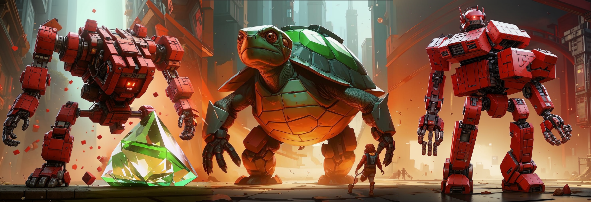

# :snake: Создаём первую игру на Python за 1 час!



Привет, будущий гейм-девелопер! 

Сегодня мы сделаем простую игру, где ты будешь управлять оранжевым шариком, убегать от красных квадратов и собирать зелёные треугольники. 

На самом деле:

- 🟠 -- боевая черепаха
- 🟥 -- бот-охранник
- 💚 -- магический зелёный бриллиант

Поехали!

## 🔧 Подготовка

1. Открой IDLE (если нет Python - скачай с [python.org](https://python.org)) или изучай Vim и работай, как настоящий программер 😉
1. Создай новый файл: File → New File
1. Сохрани как my_game.py

## 🏗️ Шаг 1: Настраиваем игру

```Python
# Импортируем только нужные модули
from turtle import Turtle, Screen
from random import randint

# Настройки игры
SCREEN_WIDTH = 800   # Ширина экрана
SCREEN_HEIGHT = 600  # Высота экрана
PLAYER_SPEED = 10    # Скорость игрока
BOT_SPEED = 5        # Скорость врагов (в 2 раза медленнее игрока)
```

💡 *Совет: Эти числа можно менять чтобы сделать игру сложнее/легче!*

## 🧩 Шаг 2: Создаём главного героя

```Python
class Hero(Turtle):
    def __init__(self):
        super().__init__()  # Используем "силу" черепашки
        self.shape("circle")  # Делаем круглым
        self.color("orange")  # Оранжевый цвет
        self.penup()  # Чтобы не рисовал линию
        self.speed(0)  # Максимальная скорость анимации
        self.goto(0, -200)  # Стартовая позиция
        self.step = PLAYER_SPEED  # Скорость движения
    
    # Функции движения
    def move_up(self):
        self.goto(self.xcor(), self.ycor() + self.step)
    
    def move_down(self):
        self.goto(self.xcor(), self.ycor() - self.step)
    
    def move_left(self):
        self.goto(self.xcor() - self.step, self.ycor())
    
    def move_right(self):
        self.goto(self.xcor() + self.step, self.ycor())
```

🎮 Проверь: Попробуй создать героя и подвигать его!

## 👾 Шаг 3: Добавляем врагов

```Python
class Enemy(Turtle):
    def __init__(self, x, y):
        super().__init__()
        self.shape("square")
        self.color("red")
        self.penup()
        self.speed(0)
        self.goto(x, y)
        self.step = BOT_SPEED
        self.x_start = x  # Начальная точка
        self.y_start = y
        self.x_end = -x   # Конечная точка
        self.y_end = y
    
    def move(self):
        self.forward(self.step)  # Двигаемся вперед
        # Если дошли до края - разворачиваемся
        if self.distance(self.x_end, self.y_end) < self.step:
            self.goto(self.x_start, self.y_start)
            self.setheading(self.towards(self.x_end, self.y_end))
```

💥 **Важно: Враги будут ходить туда-сюда автоматически!**

## 🎯 Шаг 4: Создаём цель

```Python
class Target(Turtle):
    def __init__(self):
        super().__init__()
        self.shape("triangle")
        self.color("green")
        self.penup()
        self.speed(0)
        self.goto(0, 250)
        self.new_position()
    
    def new_position(self):
        x = randint(-300, 300)  # Случайная позиция по X
        y = randint(100, 250)   # Случайная позиция по Y
        self.goto(x, y)
```

🍀 *Фишка: Цель будет телепортироваться при касании!*

## 🎮 Шаг 5: Настраиваем управление

```Python
def setup_controls(player, screen):
    # СТРЕЛКИ
    screen.onkey(player.move_up, "Up")      # Стрелка вверх
    screen.onkey(player.move_down, "Down")  # Стрелка вниз
    screen.onkey(player.move_left, "Left")  # Стрелка влево
    screen.onkey(player.move_right, "Right") # Стрелка вправо
    # VIM keys
    screen.onkey(player.move_up, "k")    # k = вверх
    screen.onkey(player.move_down, "j")  # j = вниз
    screen.onkey(player.move_left, "h")  # h = влево
    screen.onkey(player.move_right, "l") # l = вправо

    screen.listen()  # Начинаем слушать клавиатуру
```

⌨️ *Дополнительно: Можно добавить управление на WASD!*

## 🏁 Шаг 6: Главная функция игры

```Python
def main():
    # Создаем экран
    screen = Screen()
    screen.setup(SCREEN_WIDTH, SCREEN_HEIGHT)
    screen.title("Моя первая игра!")
    screen.bgcolor("black") # в "Алгоритмике" эта опция не поддерживалась. Можно закомментить.
    
    # Создаем персонажей
    player = Hero()
    target = Target()
    enemy1 = Enemy(-350, 0)
    enemy2 = Enemy(350, 100)
    
    # Настраиваем управление
    setup_controls(player, screen)
    
    # Начальные значения
    score = 0
    game_over = False
    
    # Главный игровой цикл
    while not game_over: # while not False == while True - бесконечный до изменения значения
        # Двигаем врагов
        enemy1.move()
        enemy2.move()
        
        # Проверяем столкновения
        if player.distance(target) < 20:  # Если коснулись цели
            score += 1
            target.new_position()
            print(f"Счёт: {score}")
            
        if player.distance(enemy1) < 20 or player.distance(enemy2) < 20:
            print("Игра окончена! Твой счёт:", score)
            game_over = True # while not True == while False == конец цикла и игры
    
    screen.mainloop()

# Запускаем игру
if __name__ == "__main__":
    main()
```


